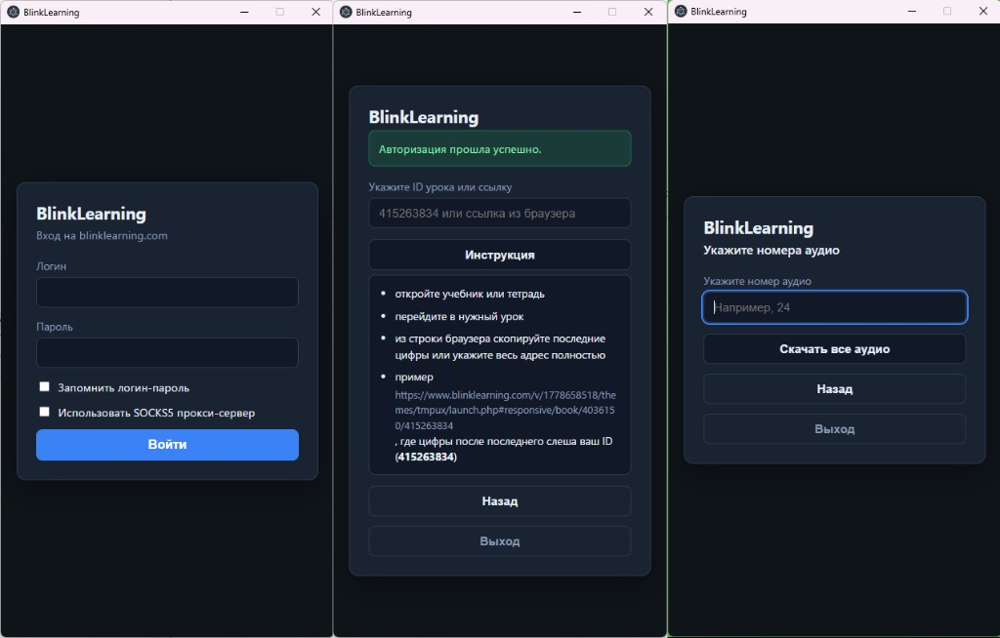

# BlinkLearning Downloader

[English version](README.en.md)

Десктопное приложение для **Windows** и **macOS** (Apple Silicon): вход на [blinklearning.com](https://www.blinklearning.com), выбор учебника и упражнения в каталоге, скачивание MP3-аудио (один трек, диапазон или автопоиск треков 01–100). Поддерживается SOCKS5-прокси. Интерфейс на **русском** и **английском** языках.

## Скачать

Актуальные сборки — на странице [релизов GitHub](https://github.com/Marfa/blinklearningdownloader/releases/latest).

| Платформа | Файл | Описание |
|-----------|------|----------|
| Windows | `BlinkLearning-Downloader-Setup-1.1.8.exe` | Установщик (NSIS) |
| Windows | `BlinkLearning-Downloader-1.1.8-win-x64-portable.exe` | Без установки — один переносимый `.exe` |
| Windows | `BlinkLearning-Downloader-1.1.8-win-x64.zip` | ZIP-архив распакованного приложения (portable) |
| macOS (Apple Silicon) | `BlinkLearning-Downloader-1.1.9-mac-arm64.zip` | Приложение `.app` в архиве |

> **Android:** мобильной сборки нет — проект основан на Electron для настольных ОС.

История изменений — в [CHANGELOG.md](CHANGELOG.md).

## Возможности



1. **Вход** — логин и пароль BlinkLearning, опционально «Запомнить логин-пароль».
2. **Прокси** — опциональный SOCKS5 (IP и порт вручную или **«Подобрать прокси»** — список SOCKS5 с [proxyscrape.com](https://proxyscrape.com/free-proxy-list), проверка доступа к blinklearning.com).
3. **Каталог** — после входа список учебников (алфавит, поиск по названию); у учебников без лицензии — **Faltan Licencias** и замок. Далее главы → упражнения; выбор упражнения сразу открывает шаг скачивания аудио.
4. **Аудио** — один номер, диапазон «С»–«По» (**Скачать диапазон аудио**) или **Скачать все аудио** (перебор треков 01–100 до первого пропуска после найденных).
5. **Прослушивание** — воспроизведение одного трека в приложении.
6. **Скачивание** — выбор папки (по умолчанию «Загрузки»), отображение прогресса.
7. **Язык** — переключение русский / английский; выбор сохраняется локально.
8. **Обновления** — уведомление о новой версии; по кнопке — запрос «Обновить приложение?», при согласии загрузка и установка из [GitHub Releases](https://github.com/Marfa/blinklearningdownloader/releases).
9. **О программе** — версия (с пометкой о доступном обновлении) и ссылка на исходный код.

### Что нового в 1.1.9

- Усилена безопасность: шифрование сохранённого пароля, предупреждение при публичном прокси, allowlist хостов для MP3, sandbox в Electron.

### Что нового в 1.1.8

- Исправлен выход приложения: процессы Electron не остаются после закрытия окна.
- Главы каталога сортируются по номерам (1, 2, … 10), а не лексикографически.

### Что нового в 1.1.7

- Уведомление об обновлении только для вашей платформы (macOS / Windows).

### Что нового в 1.1.6

- Автообновление по кнопке уведомления (запрос подтверждения, загрузка из релиза).
- Улучшен раздел «О программе».

### Что нового в 1.1.5

- Подбор SOCKS5 с proxyscrape.com; проверка прокси по доступу к BlinkLearning.
- Стабильнее загрузка каталога учебников (таймауты, сессия с прокси).

### Что нового в 1.1.4

- Доступные учебники в начале списка; **Libro Digital** выше **HTML con actividades** в упражнениях.

### Что нового в 1.1.3

- Каталог учебников, глав и упражнений; автопереход к скачиванию после выбора упражнения.
- «Скачать все аудио» и переименованный «Скачать диапазон аудио».
- Поиск учебников, индикация отсутствующих лицензий.

## Запуск в режиме разработки

```bash
npm install
npm run sync:locale
npm start
```

Проверка переводов кнопок и подписей в интерфейсе:

```bash
npm run check:i18n
```

## Сборка

**Windows** (установщик + portable `.exe` + ZIP с распакованным приложением):

```bash
npm install
npm run dist:win
```

Артефакты для GitHub-релиза (в каталог `release-build/`):

```bash
npm run dist:release
```

**macOS** (Apple Silicon), артефакты в `release-build/mac/`:

```bash
npm run dist:mac -- -c.directories.output=release-build/mac
```

Полный набор для релиза (Windows + `latest.yml`, macOS + `latest-mac.yml`):

```bash
npm run dist:release
npm run dist:mac -- -c.directories.output=release-build/mac
```

По умолчанию `dist:win` пишет в `C:\Temp\blinklearningdownloader-build\`; `dist:release` — в `release-build\`.

Пользователю достаточно скачать файл из [релиза](https://github.com/Marfa/blinklearningdownloader/releases) — Node.js отдельно не нужен.

## Проверка из командной строки (без Electron UI)

Учётные данные **только** через переменные окружения (в репозитории не хранятся):

```powershell
$env:BLINK_EMAIL="your@email"
$env:BLINK_PASSWORD="your-password"
# опционально прокси:
$env:BLINK_PROXY="1"
$env:BLINK_PROXY_HOST="your.proxy.host"
$env:BLINK_PROXY_PORT="1080"

node scripts/test-auth.js
node scripts/test-catalog.js
node scripts/test-audio-download.js
```

## Структура проекта

| Путь | Назначение |
|------|------------|
| `src/main.js` | Electron, IPC, диалог папки |
| `src/auth.js` | Авторизация, HTTP-клиент, SOCKS |
| `src/blink-catalog.js` | Список учебников, глав, упражнений |
| `src/audio.js` | Редиректы, скачивание и превью MP3 |
| `src/lesson.js` | Разбор ID / URL урока |
| `src/settings.js` | Локальные настройки |
| `src/i18n-messages.js` | Строки интерфейса (ru / en) |
| `src/update-check.js` | Проверка версии на GitHub |
| `src/auto-update.js` | Загрузка и установка обновления |
| `src/proxy-picker.js` | Подбор SOCKS5 |
| `src/renderer/` | Интерфейс |
| `assets/icons/` | Иконки |

## Разработка

Исходный код подготовлен с помощью [Cursor](https://cursor.com).

Скрипты в `scripts/` для отладки каталога и авторизации требуют `BLINK_EMAIL` и `BLINK_PASSWORD` в окружении — **не коммитьте** реальные логины и пароли. Локальные дампы и пробы — в `scripts/probe-out/` (игнорируются Git).

## Лицензия

Проект распространяется под лицензией **[CC BY-NC-SA 4.0 International](https://creativecommons.org/licenses/by-nc-sa/4.0/)**. Полный текст — в [LICENSE](LICENSE).
